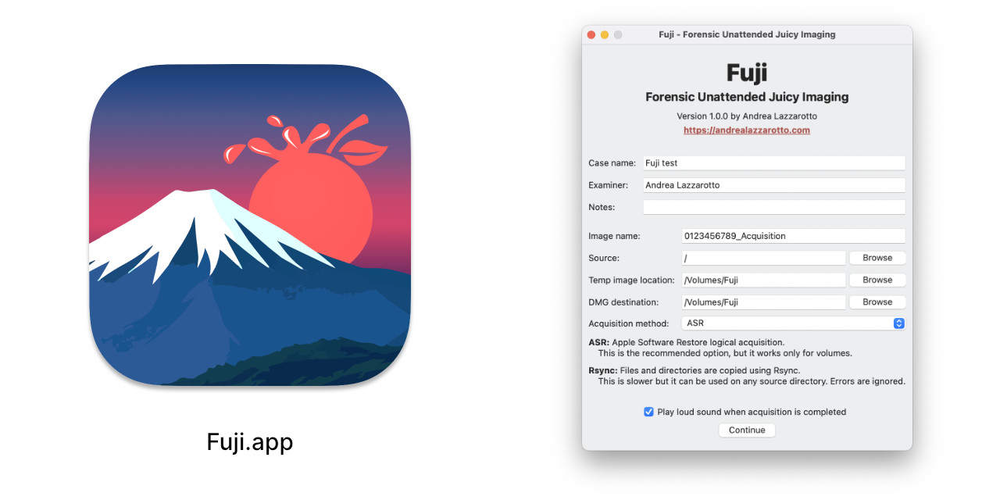

# Fuji: Forensic Unattended Juicy Imaging

Fuji is a free, open source software for performing forensic acquisition of Mac
computers. It should work on any modern Intel or Apple Silicon device, as it
leverages standard executables provided by macOS.

Fuji performs a so-called *live acquisition* (the computer must be turned on) of
*logical* nature, i.e. it includes only existing files. The software generates a
DMG file that can be imported in several digital forensics programs.

It is released under the terms of the GNU General Public License (version 3).

## Download the latest version

You can find the **latest DMG file** on the releases page:

<a href="https://github.com/Lazza/Fuji/releases" role="button" style="display: inline-block; padding: 0.5em 1em; border-radius: 0.5em; color: #fff; background: #b54e4e; box-shadow: 0px 0.5px 1.5px rgba(127, 127, 127, 0.25), inset 0px 0.8px 0px -0.25px rgba(255, 255, 255, 0.2); text-decoration: none; cursor: pointer; font-size: 120%">Download Fuji</a>

## Drive preparation

Please carefully follow the installation procedure:

1. Partition your destination drive using the **exFAT** file system
2. Set the volume label as `Fuji`
3. Download and copy the universal Fuji DMG in the drive

## How to use Fuji

1. Connect the destination drive to the target Mac computer
2. Open the Fuji DMG and click on _Full Disk Access Settings.url_
3. If the window has a "lock" icon, unlock it
4. Drag the _Fuji.app_ file on the list of authorized apps **and ensure the
   toggle is enabled**
5. Now you can run _Fuji.app_
6. When prompted, insert the password for the administrator user

### Important notes

1. Before starting the acquisition, you must specify on what drive(s) you want
to store the temporary sparseimage and the final DMG file. Both values are
`/Volumes/Fuji` by default and the _image name_ parameter will be used to make
a new directory inside those locations.

2. You must not save the disk images on the same drive you are acquiring!

3. If you want to use the Rsync mode, it is recommended to **close all other
   applications before proceeding, especially Apple Mail,** otherwise some data
   might not be collected.

4. After the acquisition is completed you are free to decide if you want to
   delete the temporary sparseimage file, or keep it. All the data is still kept
   in the DMG file.

## Troubleshooting common issues

### ASR acquisition fails with "operation not permitted"

First of all, ensure that Fuji is in the list of apps with _Full Disk Access_
permissions and the toggle is active. Close and re-open Fuji.

If the issue persists, try to acquire the _Data_ volume instead of the root
volume. It is usually called **Macintosh HD - Data** and it includes all user
files, settings and installed applications.

Fuji testers have reported that this generally solves the issue.

### ASR acquisition fails with error 49186 or 49197

This has often been reported on macOS version 13 (Ventura). The APFS volume
might need to be checked using the _SOS_ function of Disk Utility (`fsck`).

If this does not work, try acquiring the **Macintosh HD - Data** volume instead.

In some extreme cases you might need to upgrade the operating system to a newer
version or perform Rsync acquisition instead.

The Rsync acquisition method works even on damaged file systems and can be used
to acquire only a single directory instead of the whole drive. Files that cannot
be read are skipped.

### Apple Mail data is not being acquired in Rsync mode

Please ensure all other apps are closed, especially Apple Mail, before using the
Rsync acquisition method.

## Development

Fuji is developed as a Universal2 application using the **3.10 release** of
Python from [Python.org][python].

You can create a virtual environment with:

    /usr/local/bin/python3.10 -m venv env
    source env/bin/activate

The DMG file can be built by using the included Pyinstaller script:

    pip install -r requirements.txt
    pyinstaller Fuji.spec

The build process must be executed from a computer running macOS.

The README file in RTF format can be generated with pandoc:

    cat README.md | grep -v 'banner.jpg' | pandoc -f markdown -s -o dist/README.rtf

The following is a list of prerequisites if you want to modify the source code
or run Fuji from source:

- macOS version 11 or later
- Python version 3.10 (tested with [3.10.11][python310])

## Resources

These are a few of several resources that have helped in the development of this
software. Some include further reading on the topic:

- The question [How do I copy a list of folders recursively, ignoring
  errors?][superuser_question] has a couple of interesting leads, mentioning
  Rsync and Ditto.
- An answer to [Can I use ditto on OS X to sync two folders on the same
  machine?][superuser_answer] summarizes the difference between using Ditto and
  Rsync, taken from the following article.
- The [Guide to Backing Up Mac OS X][bombich_guide] by CCC's developer Mike
  Bombich includes a detailed description of Ditto, Rsync and ASR (with the
  purpose of creating full disk backups).
- [A user’s guide to Disk Images][disk_images] describes the features of sparse
  bundles and sparse images.

[python]: https://python.org
[python310]: https://www.python.org/downloads/release/python-31011/
[superuser_question]: https://superuser.com/q/91556/278831
[superuser_answer]: https://superuser.com/a/92142/278831
[bombich_guide]: https://web.archive.org/web/20100107194426/http://www.bombich.com/mactips/image.html
[disk_images]: https://eclecticlight.co/2022/07/11/a-users-guide-to-disk-images/
