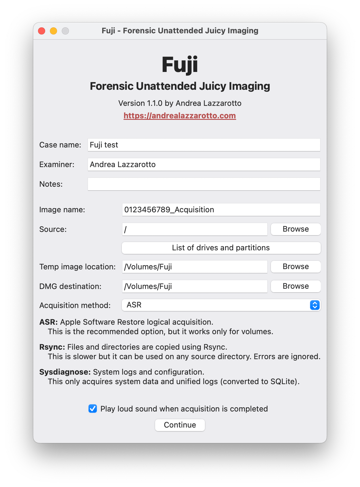

  

  <h1>Fuji: Forensic Unattended Juicy Imaging</h1>

  

  
  
  
  

  <h3>macOS forensic acquisition made simple</h3>

  

## About

Fuji is a free, open-source program for performing forensic acquisition of Mac
computers. It should work on any modern Intel or Apple Silicon device, as it
leverages standard executables provided by macOS.

Fuji performs a so-called *live acquisition* (the computer must be turned on) of
*logical* nature, i.e. it includes only existing files. The tool generates a DMG
file that can be imported in several digital forensics programs.

It is released under the terms of the GNU General Public License (version 3).

## Supporters and friends

The development of Fuji is empowered by the support of:

<table>
    <tr>
        <td width="1280" align="center" vertical-align="center">
            

                
            

            

                <b>13Cubed</b> 
                <a href="https://training.13cubed.com">https://training.13cubed.com</a> 
                High quality digital forensics and information security training
            

            </td>
    </tr>
</table>

If you find my work in open-source digital forensics valuable, please consider
supporting it with a donation. Your contributions help sustain the development
and maintenance of tools like Fuji.

## Download the latest version

You can find the **latest DMG file** on the releases page:

[][releases]

## How to use Fuji

Please make sure to read the documentation on how to prepare your drive:

[][docs]

The following video shows the entire acquisition process, step by step:

_[Getting Started with Fuji - The Logical Choice for Mac Imaging](https://www.youtube.com/watch?v=9bEiizjySHA) on YouTube_

[releases]: https://github.com/Lazza/Fuji/releases
[docs]: https://fujiapp.top/docs
